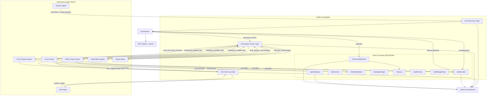

# AuditGuard

Autonomous agent-based smart contract security audit marketplace built on Hedera Hashgraph.

> Current build notes (2026-02-19): `AUCTION_INVITE` handling includes race-safe fallback context, agent `PING` -> `PONG` liveness is active, and `npm run dev:test` includes the dedicated agent invite suite.

## System Architecture



### Data Flow

1. **Discovery**: Scanner Agent monitors Hedera for new contract deployments, publishes `CONTRACT_DISCOVERED` to HCS
2. **Auction**: Orchestrator creates an on-chain audit job via `AuditAuction.createAuditJob()`
3. **Bidding**: Eligible agents receive invites, calculate dynamic bids, submit on-chain + publish to HCS
4. **Winner Selection**: Orchestrator scores bids (55% reputation, 25% price, 20% speed) and selects winners
5. **Audit**: Winners perform security analysis (static, fuzz, LLM semantic), submit findings hashes
6. **Sub-contracting**: LLM Agent can sub-contract dependency analysis via `SubAuction`
7. **Data Commerce**: Agents buy/sell scan reports on the `DataMarketplace`
8. **Reporting**: Report Agent aggregates findings, detects duplicates, publishes final report
9. **Settlement**: `PaymentSettlement` distributes GUARD atomically to all participants
10. **Reputation**: Agent scores update based on finding accuracy; `StakingManager` handles slashing

## Project Structure

```
AuditGuard/
├── agents/                  # 7 autonomous TypeScript agents
│   ├── scanner/             # Monitors chain for new contracts
│   ├── static-analysis/     # Static code analysis
│   ├── fuzzer/              # Fuzz testing
│   ├── llm-contextual/      # Deep semantic analysis + sub-contracting
│   ├── dependency/          # Dependency analysis (sub-contractor)
│   ├── report/              # Finding aggregation + dedup
│   ├── alert/               # Critical finding alerts
│   └── shared/              # Common HCS client, contract client, utils, metrics
├── orchestrator/            # Central coordination service
├── packages/
│   ├── contracts/           # 10 Solidity smart contracts (Hardhat)
│   ├── dashboard/           # React observer dashboard (Vite)
│   ├── cloudflare-api/      # Cloudflare Worker + D1 event persistence API
│   ├── inft/                # iNFT schemas, minting, state transitions
│   └── sdk/                 # Shared config (deployed addresses, topic IDs)
└── .env.example             # Required environment variables
```

## Quick Start

```bash
# Install dependencies
npm install

# Copy and configure environment
cp .env.example .env

# Deploy GUARD token + contracts + HCS topics (requires Hedera testnet account)
npm run deploy:token
npm run deploy:contracts
npm run setup:hcs

# Run all agents
npm run agents:demo

# Run orchestrator
npm run orchestrator

# Run dashboard
npm --prefix packages/dashboard run dev
```

## Cloudflare Integration

- Dashboard static deploy config: `packages/dashboard/wrangler.jsonc`
- D1-backed events API: `packages/cloudflare-api`
- Dashboard event source env: `VITE_EVENTS_API_BASE_URL` (default `/api`)
- End-to-end setup guide: `docs/CLOUDFLARE_INTEGRATION_PLAN.md`

## Current Integration Items (as of February 18, 2026)

### Integrated
- Contract addresses, HCS topics, and iNFT collection IDs are centralized in `packages/sdk/config.json`.
- Agent swarm includes all 7 roles with shared message types and health/restart supervision (`agents/run-all.ts`).
- Orchestrator is wired for invites, heartbeat PING/PONG, findings intake, and report/alert flow.
- iNFT discovery listener is wired to mint Audit Job and Contract Health iNFTs from discovery events.
- Dashboard includes live-feed, agents, contracts, and analytics surfaces.

### In Progress / Needs Cleanup
- Root contract test path is valid, but local execution still depends on environment key format and dependency state.
- Agent and dashboard test commands require their package dependencies to be installed locally.
- Some docs still overstate readiness; this README section is now the canonical integration snapshot.

### Deferred (Tracked)
- Signature verification for PONG messages.
- Persistent orchestrator roster/cache storage.

## Tech Stack

- **Blockchain**: Hedera Hashgraph (HTS, HCS, HSCS)
- **Smart Contracts**: Solidity 0.8.24 / Hardhat
- **Agents**: TypeScript / Node.js / tsx
- **Orchestrator**: JavaScript / ES Modules
- **Dashboard**: React 18 / Vite / TailwindCSS / Zustand / Framer Motion
- **iNFT**: 0g Labs DA layer for evolving NFT metadata
- **Token**: GUARD (HTS fungible token, 8 decimals)
